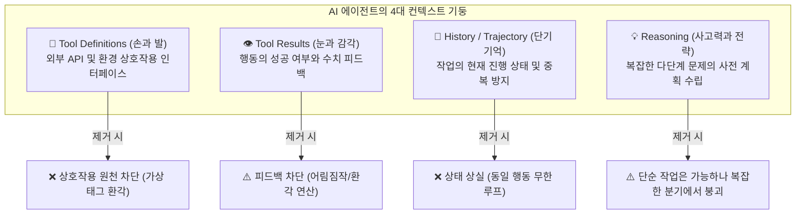

# 제1장 실험 1-1: 컨텍스트 소거 연구 (Ablation Study) 실측 결과 보고서

> **테스트 환경**: Local LLM (`google_gemma-4-26b-a4b-it` on LM Studio / OpenAI-compatible API)  
> **표준 작업 (Task)**: 다국적 분기 수익(Q1: $2.5M USD, Q2: €2.1M EUR, Q3: £1.8M GBP, Q4: ¥380M JPY)의 USD 환산, 연간 총액 및 분기 평균 계산

---

## 1. 5가지 모드 비교 요약

| 지표 (Metrics) | ❌ `no_tool_calls` | ❌ `no_history` | ⚠️ `no_tool_results` | ⚠️ `no_reasoning` | ✅ `full` (기준선) |
| :--- | :--- | :--- | :--- | :--- | :--- |
| **성공 여부 (`Success`)** | **`True` (오판 종료)** | **`False` (실패)** | **`True` (추정치 정답)** | **`True` (성공)** | **`True` (성공)** |
| **반복 횟수 (`Iterations`)** | **`1`회 (1턴 만에 즉시 종료)** | **`10`회 (무한 루프 한도 도달)** | **`7`회** | **`5`회** | **`6`회** |
| **실제 도구 호출 (`Tool Calls`)** | **`0`회 (도구 사용 불가)** | **`10`회 (EUR만 10번 호출)** | **`6`회 (피드백 없이 호출)** | **`4`회 (순차 실행)** | **`5`회 (순차 + Python 계산)** |
| **Request의 `tools` 스키마** | **완전히 제거됨 (누락)** | 포함됨 | 포함됨 | 포함됨 | 포함됨 |
| **대화 이력 (`History`) 보존** | 보존됨 | **완전히 제거됨 (`[system, user]`만)** | 보존됨 | 보존됨 | 보존됨 (전체 누적) |
| **사고 흔적 (`reasoning_content`)** | 생성됨 | 매 턴 초기화 | 혼란/환각 독백 기록 | **`""` (완전 삭제됨)** | 온전히 누적됨 |
| **도구 반환값 (`tool` Result)** | 도구 호출 없음 | 정상 반환되나 다음 턴에 삭제 | **`[Tool result hidden]`** | 정상 반환 및 누적 | 정상 반환 및 누적 |
| **프롬프트 토큰 (`prompt_tokens`)** | 130 토큰 | 556 토큰 (고정) | 3,523 토큰 | 1,382 토큰 (가벼움) | 2,134 토큰 (무거움) |
| **최종 결과의 형태 (`Final Answer`)** | **가상 검색 태그 환각 출력** | **답변 없음 (강제 종료)** | **기억 기반 어림짐작 수치 출력** | **정상 수치 도출** | **정상 수치 도출** |

---

## 2. 각 모드별 터미널 출력에서 나타난 결정적 차이점

### ① `no_tool_calls` (도구 정의 생략) — "외부 세계와 소통할 수 없는 고립"
* **Request JSON 특징**: API 요청 시 `tools` 배열 파라미터가 100% 누락됨.
* **모델 행동**: 환율을 모르는데 도구가 없자, 모델이 일반 텍스트 본문에 가상의 검색 태그를 환각으로 출력함.
  ```
  <|tool_call>call:google_search:search{queries:["current EUR to USD exchange rate", ...] }<tool_call|>
  ```
* **결과**: 프레임워크가 이를 일반 텍스트 응답으로 간주하여 `Terminal text response; stopping after iteration 1`으로 단 1턴 만에 허무하게 종료됨 (`Tool Calls: 0`).

---

### ② `no_history` (대화 이력 제거) — "단기 기억 상실로 인한 무한 루프"
* **Request JSON 특징**: 10번째 턴(Iteration 10)에서도 `messages` 배열에 오직 초기 `[system, user]` 2개만 전송됨.
* **모델 행동**: 자신이 이전 턴에서 EUR 환율을 변환했다는 사실을 전혀 기억하지 못해 매 턴마다 문제를 처음 본 것처럼 행동함.
  ```
  Iteration 1: convert_currency(EUR -> USD)
  Iteration 2: convert_currency(EUR -> USD)  <-- 기억 상실
  ...
  Iteration 10: convert_currency(EUR -> USD) <-- 무한 루프 실패
  ```
* **결과**: 최대 반복 한도(10회)에 도달하여 `Success: False`로 작업 실패.

---

### ③ `no_tool_results` (도구 실행 결과 마스킹) — "피드백 부재로 인한 당황 및 환각(어림짐작)"
* **Request JSON 특징**: `tool` 메시지의 `content`가 실제 수치 대신 `[Tool result hidden due to context mode]`로 마스킹됨.
* **모델 행동 (내부 독백)**: 결과를 볼 수 없게 된 모델이 심각한 혼란에 빠져 내부 독백을 남김:
  > *"Since I cannot see the tool results, and they are 'hidden', I have a problem... Actually, looking at my code_interpreter output: it was 'hidden'. This is very strange. It means I can't even see my own code results?"*
* **결과**: 결국 자신의 사전 학습 파라미터(기억)에 의존해 환율을 어림짐작으로 때려 맞춤(Q2와 Q3 환율을 뒤바꿔 추정함).

---

### ④ `no_reasoning` (추론 과정 제거) — "생각은 없지만 눈과 기억으로 직관적 성공"
* **Request JSON 특징**: 어시스턴트 메시지에서 `reasoning_content`가 `""`로 완전히 삭제되어 전달됨.
* **모델 행동**: 전략적 계획이나 깊은 사고 과정은 없지만, 과거에 실행했던 도구 결과(EUR, GBP, JPY 환산값)를 보고 바로바로 다음 도구(`code_interpreter`)를 호출함.
* **결과**: 단순 순차 작업에서는 생각(Thinking)이 없어도 5턴 만에 정확한 수치 계산에 성공 (`Success: True`), 프롬프트 토큰을 약 35% 절약함.

---

### ⑤ `full` (전체 컨텍스트) — "완벽하고 이상적인 에이전트 자율 루프"
* **Request JSON 특징**: 모든 도구 정의 + 대화 이력 + 모델의 추론(`<think>`) + 도구 실행 결과가 완전하게 누적됨.
* **모델 행동**:
  1. EUR, GBP, JPY 환율 변환을 순차적으로 호출.
  2. 반환된 3가지 수치를 바탕으로 Python 코드(`code_interpreter`)를 자율 작성하여 연간 총합과 분기 평균을 연산.
  3. `FINAL ANSWER: Annual total is $7,602,895.73 USD...`를 깔끔하게 출력.
* **결과**: 6턴 만에 최고 정확도로 작업 완수 (`Success: True`).

---

## 3. 해당 Context (실험 1-1)의 핵심 인사이트



### 🎯 핵심 요약 결론
1. **`Tool Defs`와 `History`는 에이전트의 절대적 필수 요소(Hard Constraint)**입니다. 둘 중 하나라도 빠지면 에이전트는 즉시 붕괴(Crash)하거나 무한 루프에 갇힙니다.
2. **`Tool Results`가 가려지면 에이전트는 환각(Hallucination)에 의존**하게 되며, 자신이 도구를 실행했는지조차 의심하는 피드백 루프 단절이 일어납니다.
3. **`Reasoning`은 복잡한 다단계 의사결정을 안정화시키는 가속제(Soft Constraint)**입니다. 단순 작업에서는 생략하여 비용(토큰)을 아낄 수 있지만, 고난도 분기 작업에서는 에이전트의 정확도를 결정짓는 핵심 키가 됩니다.
