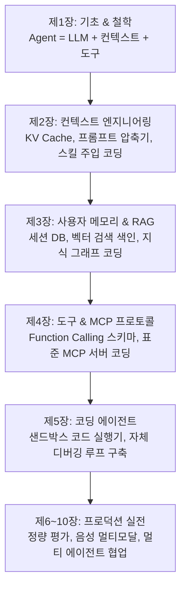

# AI 에이전트 개발 로드맵 & 엔지니어링 학습 가이드

> **"전체 추상적인 흐름은 알겠는데, 이걸 어떻게 개별적으로 코딩하고 설계할지가 전혀 머릿속에서 생성이 안 된다."**  
> 이 문서는 위와 같은 막막함을 느끼는 입문자/엔지니어를 위해, **AI 에이전트 코딩의 실체와 챕터별 빌드업 로드맵**을 정리한 가이드입니다.

---

## 1. 왜 지금 코딩이 머릿속에 바로 그려지지 않을까?

### ① 제1장의 역할은 '철학'과 '완성본 쇼케이스'입니다
* 제1장의 목적은 **"컨텍스트(이력, 추론, 도구)를 하나라도 제거하면 에이전트가 어떻게 붕괴되는가?"**를 눈으로 증명하는 것입니다.
* 이미 완성된 1,000줄 규모의 에이전트 엔진(`agent.py`)과 CLI 프레임워크를 통째로 보여주다 보니, 입문자 입장에서는 마치 **"완성된 자동차의 엔진룸 전체를 한 번에 보고 압도당한 상태"**가 된 것이며 이는 100% 자연스러운 현상입니다.

### ② 백지에서 전체를 짤 필요가 없습니다
* 실무에서도 처음부터 1,000줄짜리 복잡한 에이전트를 한 번에 코딩하지 않습니다.
* 기본 루프 하나에서 출발하여 **프롬프트 튜닝 → 도구 1개 연결 → 메모리 저장소 연동** 순으로 점진적 조립을 수행합니다.

---

## 2. 에이전트 코딩의 진짜 실체 (단 20줄의 Mental Model)

AI 에이전트는 복잡한 머신러닝 수학이 아니라, 사실 **메시지 리스트(`messages`)를 상태(State)로 관리하는 파이썬 `while` 루프**에 불과합니다.

```python
import openai

# 1. 초기 컨텍스트 설정 (시스템 프롬프트 + 사용자 작업)
messages = [
    {"role": "system", "content": "You are a helpful assistant with tools."},
    {"role": "user", "content": "Convert $1000 to EUR and calculate 10% tax."}
]

# 2. 에이전트 자율 의사결정 루프 (ReAct Loop)
while True:
    # LLM에게 지금까지의 누적 궤적(messages)과 도구 목록 전달
    response = client.chat.completions.create(
        model="google_gemma-4-26b-a4b-it",
        messages=messages,
        tools=my_tools
    )
    msg = response.choices[0].message
    messages.append(msg)  # 모델의 생각/도구 호출을 궤적에 기록!

    # 종료 조건: 도구 호출이 없으면 최종 답변 완료
    if not msg.tool_calls:
        print("최종 답변:", msg.content)
        break

    # 3. 도구 실행 및 결과 피드백 추가
    for tool_call in msg.tool_calls:
        func_name = tool_call.function.name
        func_args = json.loads(tool_call.function.arguments)
        
        # 실제 파이썬 함수 실행
        result = execute_function(func_name, func_args)
        
        # 도구 결과를 궤적에 추가하여 다음 턴에 모델이 볼 수 있게 함
        messages.append({
            "role": "tool",
            "tool_call_id": tool_call.id,
            "content": json.dumps(result)
        })
```

> 💡 **핵심 깨달음**:  
> 제1장에서 실측한 5가지 소거 실험은 위 코드에서 `messages`를 비우거나(`no_history`), `tools`를 빼거나(`no_tool_calls`), `result`를 숨겼을 때(`no_tool_results`) 루프가 어떻게 망가지는지를 확인한 것입니다.

---

## 3. 제2장 ~ 제10장: 개별 부품별 코딩 빌드업 로드맵

앞으로의 챕터들은 추상적인 개념 나열이 아니라, 위 20줄 루프 안에 들어가는 **개별 레고 블록들을 밑바닥부터 하나씩 직접 코딩**합니다.



### 🛠️ 챕터별 구체적인 코딩 실습 내용

| 챕터 | 핵심 코딩 주제 | 실제 작성하게 되는 코드 / 아티팩트 |
| :--- | :--- | :--- |
| **제2장<br>컨텍스트 엔지니어링** | 컨텍스트 최적화 & 압축 | • 대화가 길어질 때 토큰을 줄이는 **컨텍스트 압축기(`context-compression`)**<br>• 비용을 90% 아끼는 **KV Cache 최적화 파이프라인**<br>• 프롬프트 인젝션 방어 및 System Hint 주입기 |
| **제3장<br>메모리 & RAG** | 세션 영속성 & 지식 연결 | • 사용자 취향/이력을 SQLite/Vector DB에 저장하고 꺼내오는 **세션 메모리**<br>• 수천 장 문서에서 필요한 조각만 찾는 **Agentic RAG 검색 엔진**<br>• 엔티티 관계를 엮는 지식 그래프 인덱서 |
| **제4장<br>도구 & MCP** | 손발 달아주기 & 표준 연동 | • 내 파이썬 함수를 도구 스키마로 자동 변환하는 **도구 레지스트리**<br>• Anthropic 표준 규격인 **MCP (Model Context Protocol) 서버/클라이언트**<br>• 오래 걸리는 작업을 백그라운드로 돌리는 **비동기(Async) 이벤트 루프** |
| **제5장<br>코딩 에이전트** | 코드 생성 & 샌드박스 실행 | • Docker/안전 샌드박스에서 파이썬/JS 코드를 직접 돌리는 **Code Runner**<br>• 에러 로그를 보고 모델이 스스로 코드를 고치는 **Self-Correction 루프** |
| **제6~10장<br>실전 & 멀티 에이전트** | 평가, 멀티모달, 협업 | • 에이전트 성능을 수치화하는 **자동 벤치마크 테스트 스위트**<br>• 화면을 보고 클릭하는 **Computer Use / 실시간 음성 상호작용**<br>• 여러 에이전트가 역할을 나누어 회의하는 **Multi-Agent Swarm/Graph** |

---

## 4. 추천 학습 전략 (어떻게 공부해야 코딩 감각이 잡힐까?)

1. **제1장은 '직관(Mental Model)'만 챙기고 넘어가세요**:
   * *"컨텍스트 4요소(이력, 추론, 도구정의, 도구결과)가 다 있어야 에이전트가 안 멈추는구나!"*를 이해하셨다면 이미 1장의 목표를 200% 달성하신 것입니다.
   * 지금 당장 1장의 거대한 코드를 외우거나 백지에서 구현하려고 하지 마세요.
2. **제2장과 제4장부터 '부품 하나'에만 집중하세요**:
   * 제2장에서는 "프롬프트 압축 함수 1개"만 만듭니다.
   * 제4장에서는 "날씨 조회 함수를 MCP 프로토콜로 감싸는 코드 1개"만 만듭니다.
3. **작은 블록들이 모여 제1장의 거대한 시스템이 완성됩니다**:
   * 작은 파이썬 스크립트들을 하나씩 손으로 실행하다 보면, **"아! 1장에서 봤던 그 복잡한 프레임워크가 결국 이 부품들을 조립한 거였구나!"** 하고 머릿속에 설계도가 선명하게 그려지게 됩니다.
