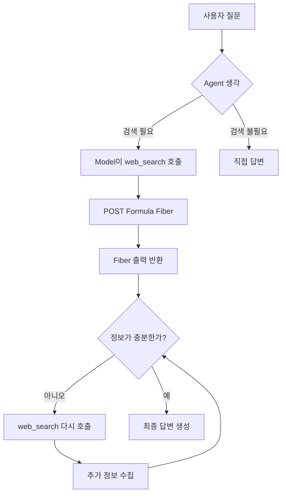

# Kimi 웹 검색 에이전트 (Kimi Web Search Agent)

> Moonshot의 공식 Formula API (다중 라운드 검색 + 종합)를 사용하는 Kimi K3 기반 자율 ReAct 웹 검색 에이전트.
> 교재 제1장 **실험 1-2 ★: Kimi K3 네이티브 Agent 능력** 연동.

← [제1장 목차로 돌아가기](../README.ko.md) · 📖 [제1장 본문 읽기](../../book-ko/chapter1.ko.md)

---

## 개요 (Overview)

본 프로젝트는 Kimi K3 및 Moonshot 공식 `moonshot/web-search:latest` Formula를 사용하여 다음을 수행하는 자율 AI 에이전트를 구현합니다:

- **질문 이해 (Understand the question)**: 사용자 쿼리를 분석하고 필요한 정보를 식별
- **자동 검색 (Search automatically)**: 표준 `web_search` 함수 선언 및 Formula Fiber를 통해 실시간 웹 정보 수집
- **반복 검색 (Iterate)**: 근거가 충분해질 때까지 검색을 여러 번 호출
- **종합 (Synthesize)**: 여러 출처의 결과를 명확하고 정확한 답변으로 종합

이 프로젝트는 "모델이 곧 에이전트(Model as Agent)"라는 개념과 ReAct 루프(생각 → 행동 → 관찰)를 보여줍니다.

## 정확한 Formula 경로 (Exact Formula route)

Kimi K3의 현재 공식 호스팅 검색 경로는 레거시 `builtin_function` 패스스루 방식이 아닙니다. 모든 독립적인 질문은 플랫폼 제어에 따라 다음의 정확한 시퀀스를 수행합니다:

1. `GET /v1/formulas/moonshot/web-search:latest/tools`를 통해 `web_search`라는 이름의 Moonshot 표준 `function` 선언을 가져옵니다.
2. 이 선언은 대화 내용과 함께 변경 없이 `POST /v1/chat/completions`로 전송됩니다. Kimi는 호출 여부와 빈도를 스스로 결정합니다.
3. 모델의 각 도구 호출에 대해, 구현체는 반환된 `name`과 직렬화된 원시 `arguments`를 변경 없이 `POST /v1/formulas/moonshot/web-search:latest/fibers`로 전달합니다.
4. `status == "succeeded"`인 HTTP 성공 Fibers만 수락됩니다. 이들의 `context.output`(또는 암호화된 출력)이 일치하는 도구 결과로 반환됩니다.

검색 엔진은 Moonshot에 의해 호스팅되며, 본 저장소는 이를 로컬이나 제3자 검색 구현으로 대체하지 않습니다. 공식 [Formula 도구 가이드](https://platform.kimi.ai/docs/guide/use-official-tools) 및 [web-search 가이드](https://platform.kimi.ai/docs/guide/use-web-search)를 참조하세요.

## 아키텍처 (Architecture)



## 빠른 시작 (Quick Start)

### 1. 의존성 설치 (Install dependencies)

```bash
# 권장 사항: 저장소 루트에서 공유 제1장 환경 사용
uv sync --locked --extra ch1

# 디렉토리를 변경하기 전에 환경을 활성화하세요:
# macOS/Linux:
source .venv/bin/activate
# Windows PowerShell: .venv\Scripts\Activate.ps1
# Windows cmd: .venv\Scripts\activate.bat

# uv가 설치되어 있지 않은 경우 pip 대체 방법:
# python -m pip install -e ".[ch1]"

# 아래 명령어 실행을 위해 본 실험 디렉토리로 이동합니다
cd chapter1/web-search-agent

# 마이그레이션 동안 여전히 지원되는 단일 프로젝트 호환 경로:
# python -m pip install -r requirements.txt
```

### 2. API Key 설정 (Configure API Key)

[Moonshot AI 플랫폼](https://platform.moonshot.ai/)에서 키를 발급받은 후 설정하세요:

```bash
export MOONSHOT_API_KEY='your-api-key-here'
```

또는 `.env` 파일을 생성하세요:

```env
MOONSHOT_API_KEY=your-api-key-here
```

**참고**: 하위 호환성을 위해 `KIMI_API_KEY`도 지원됩니다.

**범용 OpenRouter 폴백 (Universal OpenRouter fallback)**: `MOONSHOT_API_KEY`와 `KIMI_API_KEY`가 모두 설정되지 않고 `OPENROUTER_API_KEY`만 설정된 경우, 요청은 `OPENROUTER_MODEL`(기본값 `openai/gpt-5.6-luna`)을 사용하여 OpenRouter를 통해 처리됩니다. Moonshot Formula 선언 및 Fiber는 OpenRouter를 통해 노출되지 않으므로, 폴백 모드는 실시간 Formula 검색 없이 모델 자체 지식으로만 답변합니다. 이는 인터페이스 진단용으로만 유용하며 실험 1-2 승인 조건을 충족할 수 없습니다.

### 3. 에이전트 실행 (Run the Agent)

`main.py`는 전체 CLI를 제공합니다. 모든 플래그 목록 확인:

```bash
python main.py --help
```

| 플래그 | 설명 | 기본값 |
|------|-------------|---------|
| `query` | 질문 (위치 인자); 생략 시 대화형 모드로 진입 | 없음 |
| `--provider` | 백엔드: `kimi` (Moonshot Formula `web_search`, API 키 필요) / `offline-demo` (오프라인 샘플 트레이스) | `kimi` |
| `--model` | 모델 이름 | `kimi-k3` |
| `--max-steps` | 최대 ReAct 반복 횟수 | `5` |
| `--base-url` | API 기본 URL | `https://api.moonshot.cn/v1` |
| `--api-key` | Kimi API 키 (기본값: 환경 변수) | 환경 변수 |
| `--output`, `-o` | 질문, ReAct 트레이스, 답변을 JSON으로 저장 | 없음 |
| `--quiet` | ReAct 트레이스를 실시간 스트리밍하지 않음 | 스트리밍 켬 |

**오프라인 ReAct 데모** (API 키 불필요, 생각 → 행동 → 관찰 과정을 보여주는 샘플 트레이스 재생):

```bash
python main.py --provider offline-demo
```

**대화형 모드 (Interactive mode)** (지속적인 대화):

```bash
python main.py
```

**단일 질문 (Single question)** (생각 / 행동 / 관찰 단계를 스트리밍):

```bash
python main.py "2024년 노벨 물리학상 수상자는 누구인가요?"
python main.py "비트코인 현재가" --max-steps 3 --output result.json
```

**가이드형 퀵스타트 (Guided quickstart)**:

```bash
python quickstart.py
```

**고급 예제 (Advanced examples)**:

```bash
python examples.py
```

> 실행 시 에이전트는 **ReAct 트레이스**를 실시간으로 출력합니다: 💭 생각(think) → 🔧 행동(`web_search`) → 👀 관찰(Formula 출력) → ✅ 최종 답변. 구조화된 트레이스는 `agent.get_trace()`를 사용하거나 `--output` 옵션으로 JSON 저장할 수 있습니다.

---

## 사용 예제 (Usage Examples)

### 기본 사용법 (Basic usage)

```python
from agent import WebSearchAgent
from config import Config

# Agent 생성
agent = WebSearchAgent(api_key=Config.get_api_key())

# 질문하고 답변 받기
question = "Python 3.12에는 어떤 새로운 기능이 있나요?"
answer = agent.search_and_answer(question)
print(answer)
```

### 고급 기능 (Advanced features)

```bash
python examples.py
```

포함 내용:

- **일괄 검색 (Batch search)**: 한 번에 여러 질문 검색
- **컨텍스트 기반 검색 (Context-aware search)**: 명확한 쿼리를 위한 배경 정보 제공
- **비교 검색 (Comparative search)**: 여러 항목 검색 및 비교
- **팩트 체크 (Fact check)**: 주장의 진위 여부 검증
- **연구 보조 (Research assistant)**: 특정 주제에 대한 심층 연구

---

## 핵심 구성 요소 (Core Components)

### `agent.py` — 핵심 에이전트 구현

- `WebSearchAgent`: 메인 에이전트 클래스
- `search_and_answer()`: ReAct 루프를 실행하고 답변을 생성하는 메인 메서드
- `get_trace()`: 마지막 실행의 구조화된 ReAct 트레이스 반환 (생각 / 행동 / 관찰 / 최종 답변)
- `_chat()`: Kimi API와 대화 수행
- `_get_system_prompt()`: 에이전트 동작을 정의하는 시스템 프롬프트 반환
- `_get_tools()`: 도구 정의 (`$web_search`)
- `search_impl()`: 검색 구현 레이어 (확장 지점)
- `format_trace_step()`: 하나의 트레이스 단계를 읽기 쉬운 텍스트로 포맷팅
- `run_offline_demo()`: 오프라인 샘플 트레이스 재생 (API 키 없이 ReAct 루프 시연)

### `config.py` — 환경 설정

- API 설정
- 모델 선택
- 검색 매개변수 설정

### `main.py` — 실행 엔트리포인트

- `build_parser()`: argparse CLI (도움말: `--help`)
- `run_interactive_mode()`: 대화형 모드
- `run_single_question()`: 단발성 Q&A
- 오프라인 데모 (`--provider offline-demo`) 및 JSON 출력 (`--output`)
- 세션 관리

### `quickstart.py` — 가이드 데모 스크립트

- `demo_search()`: 데모 검색
- `interactive_mode()`: 단순화된 대화형 모드
- 컬러 출력 및 사용자 안내
- API 키 설정 확인

### `examples.py` — 고급 데모

- `AdvancedWebSearchAgent`: 기능 확장 에이전트 클래스
- `batch_search()`: 여러 질문 일괄 처리
- `search_with_context()`: 컨텍스트 기반 검색
- `comparative_search()`: 여러 항목 비교
- `fact_check()`: 팩트 체크 기능
- `example_research_assistant()`: 심층 연구 예제

---

## 설정 옵션 (Configuration Options)

| 설정 항목 | 설명 | 기본값 |
|------|-------------|---------|
| `MOONSHOT_API_KEY` | Moonshot AI API 키 | 필수 |
| `KIMI_API_KEY` | 레거시 API 키 환경변수 이름 (호환성) | 선택 |
| `KIMI_BASE_URL` | API 기본 URL | `https://api.moonshot.cn/v1` |
| `DEFAULT_MODEL` | 기본 모델 | `kimi-k3` |
| `MAX_SEARCH_ITERATIONS` | 최대 검색 반복 횟수 (Config 설정) | 5 |
| `SEARCH_TIMEOUT` | 검색 타임아웃 (초) | 30 |
| `temperature` | 생성 창의성 조절 | 0.6 |

---

## 기술적 세부사항 (Technical Notes)

### 핵심 기술 스택

- **Kimi API**: 네이티브 웹 검색 능력을 갖춘 Moonshot Kimi K3 (`kimi-k3`) 추론 모델
- **내장 도구 호출**: Kimi의 `$web_search` 내장 함수 활용
- **반복적 검색**: 정보가 충분해질 때까지 최대 5라운드 검색 수행
- **컨텍스트 관리**: 연속 대화를 위한 전체 대화 기록 유지
- **온도 조절 (Temperature)**: 생성 창의성 조절 가능

### 장점

- **실시간 정보**: 최신 웹 검색 결과 반영
- **의도 파악**: 질문에 맞춘 정확한 검색
- **구조화된 답변**: 잘 정돈된 응답 구성
- **확장성**: `search_impl` 및 관련 훅을 통한 손쉬운 기능/도구 추가

---

## 개발 계획 (미구현 사항)

- [ ] 비동기 검색 지원 (aiohttp 사용)
- [ ] 검색 결과 캐싱 기능
- [ ] `search_impl`을 통한 다양한 검색 백엔드 추가
- [ ] 다국어 검색 지원
- [ ] 검색 결과 품질 점수 평가
- [ ] 검색 히스토리 기록
- [ ] 재시도 메커니즘 통합 (tenacity 사용)
- [ ] 긴 대화의 컨텍스트 관리 최적화

---

## 주의 사항 (Caveats)

1. **API 제한**: Kimi API의 호출 제한 및 할당량을 준수하세요.
2. **검색 품질**: 검색 결과의 품질은 Kimi의 검색 능력에 의존합니다.
3. **지연 시간**: 웹 검색에 시간이 소요될 수 있습니다.
4. **정확성**: 중요한 사실은 재검증하세요; 에이전트가 오답을 낼 수도 있습니다.

---

## 사용 팁 (Usage tips)

1. **명확한 질문**: 질문이 구체적일수록 더 나은 답변을 얻습니다.
2. **컨텍스트 제공**: 필요할 때 배경 정보를 함께 제공하세요.
3. **단계적 개선**: 첫 답변이 부족하면 세부사항을 추가하여 재질문하세요.
4. **기대치 설정**: 답변은 검색 결과에 기반하며 모든 것을 다루지 못할 수 있습니다.

---

## 관련 링크 (Links)

- [Kimi API 문서](https://platform.moonshot.ai/docs)
- [Web 검색 도구 문서](https://platform.moonshot.ai/docs/guide/use-web-search)
- [Moonshot AI 플랫폼](https://platform.moonshot.ai/)

---

## 참고 사항 (Notes)

- 라이선스: MIT.
- API 할당량을 사용하지 않고 ReAct 동작 형태만 확인하려면 `--provider offline-demo`를 먼저 실행하는 것이 좋습니다.
- 실시간 웹 검색은 Moonshot API 키가 필요하며, OpenRouter 폴백 모드에서는 `$web_search`가 지원되지 않습니다.
